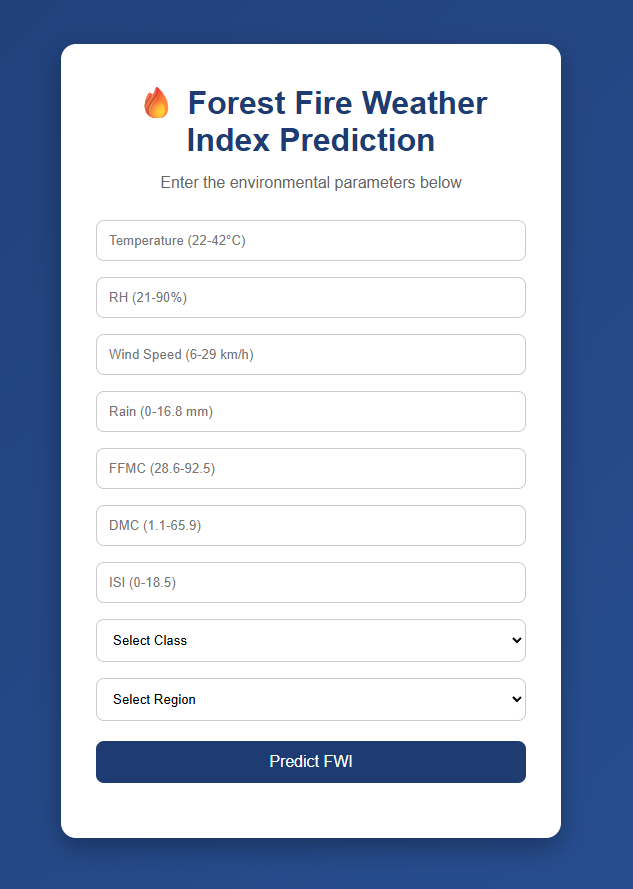

# Machine Learning Regression Projects

A collection of regression-based machine learning projects implemented using Python and Scikit-Learn.

## Projects Included

### 1. Simple Linear Regression
- Height vs Weight Prediction
- Data Visualization
- Model Evaluation

### 2. Multiple Linear Regression
- Economic Index Prediction
- Feature Analysis
- Model Training

### 3. Polynomial Regression
- Non-linear Data Modelling
- Polynomial Features
- Performance Comparison

### 4. Ridge Regression
- Regularization
- Hyperparameter Tuning

### 5. Lasso Regression
- Feature Selection
- Regularization

### 6. ElasticNet Regression
- Combined Ridge + Lasso
- Cross Validation

### 7. Forest Fire Weather Index Prediction
- Algerian Forest Fire Dataset
- Feature Engineering
- Flask Web Deployment

## Technologies Used

- Python
- NumPy
- Pandas
- Matplotlib
- Seaborn
- matplotlib
- Scikit-Learn
- Flask
- Jupyter Notebook

## Application Preview

### Home Page

### Prediction Result

## Developer

Anjali Sharma
